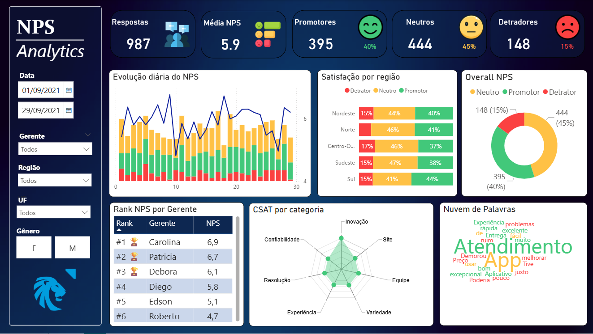
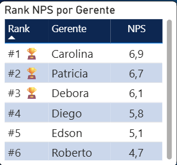
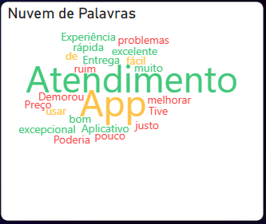

# 📊 NPS Analytics – Agência Bancária (Projeto Fictício)

Projeto de análise de Net Promoter Score (NPS) desenvolvido em Power BI,
utilizando dados fictícios para simular o cenário de uma agência bancária.

O dashboard organiza avaliações de clientes e apresenta indicadores de forma
clara, permitindo acompanhar a evolução do NPS, comparar desempenho entre
gerentes e analisar a satisfação por categoria.

---

## 🏦 Contexto

A agência bancária realiza pesquisas de satisfação após interações com clientes,
como atendimento em agência, uso de canais digitais e resolução de demandas.

Apesar da coleta dessas avaliações, a análise tende a ser fragmentada,
dificultando a comparação de resultados e o acompanhamento consistente
dos indicadores.

---

## ❗ Problema abordado

Dificuldades comuns na análise de NPS, como:

- dados dispersos e pouco padronizados;
- comparação limitada de desempenho entre gerentes;
- baixa visibilidade sobre a distribuição entre detratores, neutros e promotores;
- pouco aproveitamento dos feedbacks textuais;
- ausência de uma visão consolidada para análise ao longo do tempo.

---

## ✅ Solução

Foi desenvolvido um dashboard interativo que permite:

- visualizar a média de NPS e sua evolução temporal;
- analisar a proporção de detratores, neutros e promotores;
- comparar a performance média entre gerentes por meio de ranking;
- avaliar a satisfação por categoria (CSAT);
- explorar feedbacks textuais de clientes;
- aplicar filtros por período, gerente e perfil.

---

## 📷 Visão geral do dashboard



---

## 🏆 Ranking de gerentes

Análise comparativa do desempenho médio de NPS entre gerentes.



---

## 📊 Satisfação por categoria (CSAT)

Avaliação da experiência do cliente em diferentes dimensões do serviço bancário.


---

## 💬 Feedbacks dos clientes

Análise qualitativa dos comentários coletados nas pesquisas.



---

## 🛠️ Tecnologias utilizadas

- **Power BI** – Visualização e análise de dados  
- **DAX** – Cálculos de NPS, métricas e rankings  
- **Excel** – Base de dados fictícia  
- **Modelagem de dados** – Boas práticas de BI  

---

## 📂 Estrutura do repositório

```text
/
├── README.md
├── data/
│   └── BD_NPS_distribuicao_rank_gerentes.xlsx
├── docs/
│   └── NPS_Analytics_Banco.pbix
├── images/
│   ├── dashboard_full_
